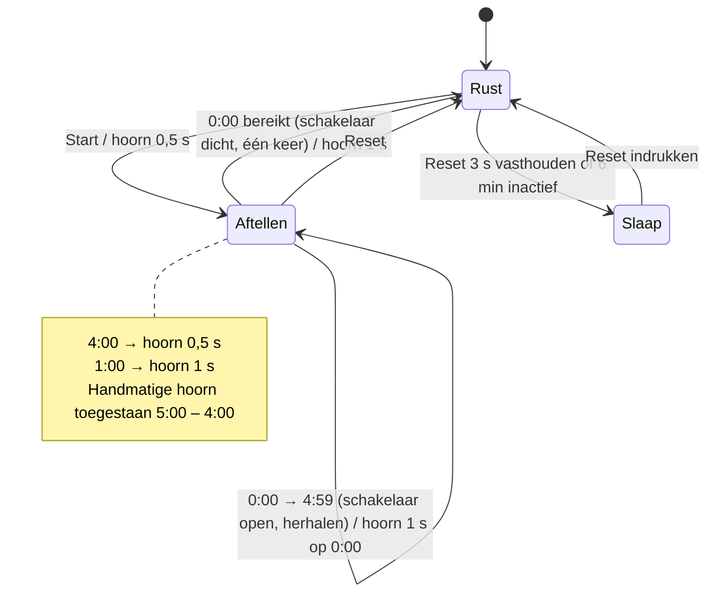

# Timer ZZ

Firmware voor een ESP32-gestuurde starttimer met hoornrelais, twee displays en een handmatige hoornknop. De timer telt een startprocedure van 5 minuten af en geeft op vaste momenten automatisch een hoornsignaal via een relais (5:00, 4:00, 1:00 en 0:00 — hetzelfde ritme als een 5-4-1-0-startprocedure).

Deze repository bevat alle zeven ontwikkelversies. Elke versie staat in een eigen map én als eigen commit met tag (`v1` t/m `v7`) in de git-historie, zodat je de verschillen tussen versies direct kunt vergelijken.

> **Laatste versie: V7** (`firmware/Timer_ZZ_V7`). V1 en V2 compileren niet zonder aanpassing (zie [Bekende problemen](#bekende-problemen)).

---

## Inhoud

- [Repository-indeling](#repository-indeling)
- [Hardware](#hardware)
- [Pinout per versie](#pinout-per-versie)
- [Werking (V7)](#werking-v7)
- [Opbouw van de code](#opbouw-van-de-code)
- [Het schuifregister-display](#het-schuifregister-display)
- [Versieoverzicht](#versieoverzicht)
- [Bouwen en uploaden](#bouwen-en-uploaden)
- [Firmware flashen (release)](#firmware-flashen-release)
- [Bekende problemen](#bekende-problemen)

---

## Repository-indeling

```
timer-zz/
├── README.md              ← dit bestand
├── CHANGELOG.md           ← gedetailleerde wijzigingen per versie
├── .github/workflows/
│   └── release.yml        ← bouwt de .bin-bestanden en maakt een GitHub-release
└── firmware/
    ├── Timer_ZZ_V1/Timer_ZZ_V1.ino
    ├── Timer_ZZ_V2/Timer_ZZ_V2.ino
    ├── Timer_ZZ_V3/Timer_ZZ_V3.ino
    ├── Timer_ZZ_V4/Timer_ZZ_V4.ino
    ├── Timer_ZZ_V5/Timer_ZZ_V5.ino
    ├── Timer_ZZ_V6/Timer_ZZ_V6.ino
    └── Timer_ZZ_V7/Timer_ZZ_V7.ino
```

Elke versie staat in een map met dezelfde naam als het `.ino`-bestand; de Arduino IDE vereist dat. De code zelf is ongewijzigd ten opzichte van de originele bestanden — alleen de bestandsnamen zijn gelijkgetrokken (`Timer_ZZ.ino` → `Timer_ZZ_V1.ino`, `Timer_ZZV5.ino` → `Timer_ZZ_V5.ino`, `Timer_ZZV6.ino` → `Timer_ZZ_V6.ino`, `Timer_ZZV7.ino` → `Timer_ZZ_V7.ino`).

---

## Hardware

| Onderdeel | Functie | Vanaf |
|---|---|---|
| ESP32-bord | Microcontroller (de code gebruikt `IRAM_ATTR` en ESP32-GPIO-nummers) | V1 |
| TM1637 4-digit display | Toont de tijd als `MM:SS` met dubbele punt | V1 |
| Relaismodule | Schakelt de hoorn | V1 |
| Startknop | Start de procedure | V1 |
| Resetknop | Reset, slaapmodus aan/uit | V1 |
| Handmatige hoornknop | Hoorn met de hand bedienen | V2 (V1: pin niet gedefinieerd) |
| Schuifregister-display ("matrix board") | Groot 3-digit display `M.SS` via drie in serie geschakelde schuifregisters | V3 |
| Tweede schuifregister-display | Tweede groot 3-digit display in dezelfde keten (zes registers in totaal), toont dezelfde tijd | V7 |
| Enable-lijn matrix board | Schakelt het grote display aan (`HIGH`) of uit (`LOW`) | V3 |
| Uitgang `horn_button` | Statussignaal dat aangeeft of de handmatige hoorn is toegestaan (vermoedelijk een LED in de hoornknop) | V3 |
| Modusschakelaar `timer_switch` | V3: stoppunt optellen · V4–V6: direct aftellen of eerst optellen · V7: één keer of herhalen | V3 |

Alle knoppen en de schakelaar gebruiken `INPUT_PULLUP`: ingedrukt / gesloten = `LOW`, los / open = `HIGH`.

### Bibliotheken

| Bibliotheek | Gebruikt voor | Vanaf |
|---|---|---|
| `TM1637Display` (library "TM1637" van Avishay Orpaz) | TM1637-display | V1 |
| `Bounce2` | Software-debouncing van de knoppen | V4 |

---

## Pinout per versie

| Functie | V1 | V2 | V3 | V4 | V5 – V7 |
|---|---|---|---|---|---|
| TM1637 `CLK` | 18 | 18 | 18 | 18 | 18 |
| TM1637 `DIO` | 19 | 19 | 19 | 19 | 19 |
| `BUTTON_START` | 34 | 23 | 23 | 23 | 23 |
| `BUTTON_RESET` | 35 | 13 | 13 | 13 | 13 |
| `MANUAL_RELAY` | — ¹ | 14 | 14 | 14 | 14 |
| `RELAY_PIN` | 16 | 27 | 27 | 27 | 27 |
| Schuifregister `dataPin` | — | — | 33 | 33 | 33 |
| Schuifregister `clockPin` | — | — | 32 | 32 | 32 |
| Schuifregister `latchPin` | — | — | 26 | 26 | 26 |
| Matrix `enable` | — | — | 25 | 25 | 25 |
| `horn_button` (uitgang) | — | — | 21 | 21 | **22** |
| `timer_switch` (ingang) | — | — | 22 | 22 | **21** |

¹ In V1 is `manual_relay` als lege `#define` opgenomen zonder pinnummer; zie [Bekende problemen](#bekende-problemen).

Let op: in V5 zijn `horn_button` en `timer_switch` van pin gewisseld ten opzichte van V3/V4.

---

## Werking (V7)

### Modusschakelaar

De stand van `timer_switch` wordt ingelezen op het moment dat je op start drukt. De beginstand is altijd `5:00`.

| `timer_switch` | Niveau | Verloop |
|---|---|---|
| Gesloten (naar GND) | `LOW` | **Eén keer:** aftellen van 5:00 naar 0:00, daarna stoppen. `0:00` blijft 1 s staan, daarna springt het display terug naar `5:00`. |
| Open | `HIGH` | **Herhalen:** na 0:00 gaat de timer direct verder vanaf `4:59`. Zo start er elke 5 minuten een nieuwe cyclus, tot je op reset drukt. |

Let op: het commentaar bij `repeatMode` in de code zegt het omgekeerde (`LOW = eindeloos`). De code zelf doet `repeatMode = (digitalRead(timer_switch) == HIGH)`, dus **open = herhalen**. Bovenstaande tabel volgt de code.

### Hoornsignalen

| Moment | Duur relais |
|---|---|
| Start (5:00) | 0,5 s |
| 4:00 | 0,5 s |
| 1:00 | 1 s |
| 0:00 | 1 s |

Elk signaal wordt per cyclus één keer gegeven (bijgehouden in `triggeredRelay[]`). In herhaalmodus is het signaal op 0:00 tegelijk het begin van de volgende cyclus; er komt dan geen apart 5:00-signaal, de volgende cyclus begint op `4:59`.

### Knoppen

| Knop | Actie | Resultaat |
|---|---|---|
| Start | Kort indrukken in rust | Procedure start. Tijdens een lopende procedure of in slaapmodus wordt de knop genegeerd. |
| Reset | Indrukken | Direct terug naar `5:00`, ook tijdens een lopende procedure (ook de enige manier om de herhaalmodus te stoppen). |
| Reset | 3 s vasthouden (in rust) | Slaapmodus: alle displays uit. |
| Reset | Indrukken in slaapmodus (≥ 100 ms) | Displays weer aan, zonder reset. |
| Handmatige hoorn | Vasthouden | Relais aan zolang de knop is ingedrukt — alleen toegestaan in rust en tijdens de eerste minuut van elke cyclus (5:00 t/m 4:00). |

De uitgang `horn_button` is `LOW` wanneer de handmatige hoorn is toegestaan en `HIGH` wanneer hij geblokkeerd is.

### Slaapmodus

- Handmatig: reset 3 s vasthouden terwijl de timer niet loopt.
- Automatisch: na 6 minuten zonder activiteit (`360000` ms).
- In slaapmodus zijn alle displays uit en is de enable-lijn van de grote displays `LOW`. De handmatige hoorn blijft werken.

### Toestandsdiagram



### Verschil met V6

V6 had in plaats van de herhaalmodus een optelmodus (eerst 0:00 → 4:00 optellen, dan aftellen vanaf 5:00). Die is in V7 vervallen. Zie [CHANGELOG.md](CHANGELOG.md).

---

## Opbouw van de code

De firmware is volledig **niet-blokkerend**: er wordt nergens `delay()` gebruikt. Alles draait in `loop()` op basis van `millis()`-tijdstempels.

### Belangrijkste variabelen (V7)

| Variabele | Betekenis |
|---|---|
| `counting` | Timer loopt |
| `repeatMode` | `true` = herhalen na 0:00, `false` = één keer (gezet bij start) |
| `minutes`, `seconds` | Huidige tijd |
| `triggeredRelay[6]` | Per minuut (index 0–5): is het signaal al gegeven? |
| `relayActive`, `relayStartMillis`, `relayDuration` | Automatisch relaissignaal en de duur ervan |
| `manualRelayActive` | Handmatige hoornknop ingedrukt |
| `previousMillis` | Tijdstempel van de laatste seconde-tik |
| `sleepMode`, `lastActiveMillis` | Slaapmodus en tijdstip van laatste activiteit |
| `resetButtonHeld`, `resetPressStart`, `ignoreResetUntilRelease` | Vasthoud-detectie van de resetknop |

### Volgorde in `loop()` (V7)

1. **Knoppen inlezen** — `Bounce2`-objecten bijwerken; startknop op dalende flank.
2. **Resetknop** — reset direct bij indrukken; vasthoudduur meten voor slaapmodus; na een slaap-overgang wordt de knop genegeerd tot hij is losgelaten.
3. **Automatische slaap** na 6 minuten inactiviteit.
4. **Start** — tijd op 5:00, `repeatMode` inlezen van `timer_switch`, startsignaal geven.
5. **Reset** — alles terug naar 5:00.
6. **Signaalcontrole** — elke loop-doorgang (zolang de timer loopt) wordt gekeken of de huidige tijd 4:00, 1:00 of 0:00 is en het signaal nog niet gegeven is. In V6 gebeurde dit alleen direct na de seconde-tik.
7. **Seconde-tik** — tijd één seconde terug; bij 0:00 verder vanaf 4:59 (herhalen, `triggeredRelay[]` gewist) of stoppen (één keer); displays verversen. `previousMillis += 1000` zorgt dat de timer niet wegloopt, ook als een loop-doorgang wat langer duurt.
8. **Relais-timeout** — automatisch signaal uit na `relayDuration`.
9. **Rustweergave** — display op 5:00.
10. **Relaisuitgang** — `relaisAan = (handmatig && toegestaan) || automatisch`; statusuitgang `horn_button` zetten.

### Displays

- **TM1637**: `display.showNumberDecEx(minutes * 100 + seconds, 0b01000000, true)` toont bijvoorbeeld `05:00`, met dubbele punt en voorloopnullen.
- **Schuifregister-display**: `updateShiftRegisterDisplay(minutes, seconds)` — zie hieronder.

---

## Het schuifregister-display

Het grote display (vanaf V3) bestaat uit drie 7-segmentcijfers die elk door een 8-bits schuifregister worden aangestuurd. De drie registers staan in serie; met `shiftOut()` worden drie bytes na elkaar ingeschoven en daarna met de latch-pin tegelijk doorgezet.

De bedrading van de segmenten wijkt af van de standaardvolgorde. `mapSegments()` zet daarom segmenten om naar de juiste bitposities:

| Segment | a | b | c | d | e | f | g | dp |
|---|---|---|---|---|---|---|---|---|
| Bit | 5 | 6 | 2 | 1 | 0 | 4 | 7 | 3 |

De tabel `digits[10]` bevat de voorberekende byte voor elk cijfer 0–9. Omdat `dp` standaard `true` is, staat de decimale punt bij alle cijfers altijd aan.

Er worden drie cijfers getoond: minuten (`minutes % 10`), tientallen seconden en eenheden seconden. De volgorde waarin de bytes worden ingeschoven (eerst seconden-eenheden, als laatste de minuten) is afgestemd op de bedrading van het board.

In V7 schuift `updateShiftRegisterDisplay()` dezelfde drie bytes twee keer in (zes bytes totaal), zodat twee grote displays in dezelfde keten dezelfde tijd tonen. `clearShiftRegisterDisplay()` wist ook zes registers.

---

## Versieoverzicht

| Versie | Belangrijkste wijziging |
|---|---|
| **V1** | Basis: aftellen 5:00 → 0:00 op TM1637, relais bij start, 4:00, 1:00, 0:00. Knoppen via interrupts. |
| **V2** | Nieuwe pinout. Na 0:00 optellen tot 4:00 met knipperend `00:00`. Aparte handmatige hoornknop. |
| **V3** | Groot schuifregister-display, statusuitgang `horn_button`, modusschakelaar (optellen stopt bij 4:00 of 5:00). |
| **V4** | `Bounce2`-debouncing i.p.v. interrupts, slaapmodus, nieuwe modus: eerst optellen tot 4:00 en dan aftellen vanaf 5:00. Driftvrije tijdbasis. |
| **V5** | Reset direct bij indrukken, handmatige hoorn ook toegestaan tussen 5:00 en 4:00, auto-slaap na 6 min, pinnen `horn_button`/`timer_switch` gewisseld. |
| **V6** | Instelbare relaisduur: 0,5 s bij start en 4:00, 1 s bij 1:00 en 0:00. |
| **V7** | Optelmodus vervangen door herhaalmodus (elke 5 min een nieuwe cyclus), tweede groot display, beginstand altijd 5:00, signaalcontrole elke loop-doorgang. |

Zie [CHANGELOG.md](CHANGELOG.md) voor de volledige beschrijving per versie. Verschillen bekijken kan ook met git, bijvoorbeeld:

```bash
git diff v6 v7 -- firmware/
```

---

## Bouwen en uploaden

1. Installeer de **Arduino IDE** (of `arduino-cli`) met de **ESP32-boardondersteuning** van Espressif.
2. Installeer via Bibliotheekbeheer:
   - **TM1637** (Avishay Orpaz)
   - **Bounce2** (nodig vanaf V4)
3. Open `firmware/Timer_ZZ_V7/Timer_ZZ_V7.ino`.
4. Kies je ESP32-bord en poort, en upload.

Met `arduino-cli`:

```bash
arduino-cli lib install "TM1637" "Bounce2"
arduino-cli compile --fqbn esp32:esp32:esp32 firmware/Timer_ZZ_V7
arduino-cli upload  --fqbn esp32:esp32:esp32 -p <poort> firmware/Timer_ZZ_V7
```

Pas de `--fqbn` aan als je een ander ESP32-bord gebruikt.

V3 t/m V7 zijn gecompileerd met ESP32-core 3.3.12, TM1637 1.2.0 en Bounce2 2.72 (V7: 274 940 bytes flash, 22 268 bytes RAM).

---

## Firmware flashen (release)

Bij elke release staan kant-en-klare `.bin`-bestanden, gebouwd voor een standaard ESP32 (board "ESP32 Dev Module", 4 MB flash). Je hebt dan geen Arduino IDE nodig.

| Bestand | Adres | Gebruik |
|---|---|---|
| `Timer_ZZ_V7_esp32_volledig_0x0.bin` | `0x0` | **Aanbevolen.** Alles in één bestand (bootloader, partities en programma). |
| `Timer_ZZ_V7_esp32_bootloader_0x1000.bin` | `0x1000` | Los: bootloader |
| `Timer_ZZ_V7_esp32_partities_0x8000.bin` | `0x8000` | Los: partitietabel |
| `Timer_ZZ_V7_esp32_app_0x10000.bin` | `0x10000` | Los: alleen het programma (update van een ESP32 die al Arduino-firmware heeft) |

### Via de browser (Chrome of Edge)

1. Ga naar de [Espressif esptool-js webflasher](https://espressif.github.io/esptool-js/).
2. Sluit de ESP32 aan via USB en klik **Connect**; kies de COM-poort.
3. Vul bij *Flash Address* `0x0` in en kies `Timer_ZZ_V7_esp32_volledig_0x0.bin`.
4. Klik **Program**. Druk na afloop op de EN/RST-knop van de ESP32.

Lukt verbinden niet, houd dan de BOOT-knop ingedrukt terwijl je op Connect klikt.

### Via esptool (opdrachtregel)

```bash
pip install esptool
esptool --chip esp32 --port COM5 --baud 921600 write-flash 0x0 Timer_ZZ_V7_esp32_volledig_0x0.bin
```

Vervang `COM5` door jouw poort (Linux/macOS: bijv. `/dev/ttyUSB0`). Bij oudere esptool-versies heet het commando `esptool.py ... write_flash`.

### Een release maken

De workflow `.github/workflows/release.yml` bouwt de firmware op GitHub en maakt de release:

- **Handmatig:** tabblad **Actions** → **Firmware release** → **Run workflow** → versienummer (bijv. `7`).
- **Automatisch:** push een nieuwe tag (bijv. `v8`) op een commit waarin de workflow staat.

Gebruik je een ander ESP32-bord (bijv. ESP32-S3), pas dan `FQBN` in de workflow aan; de adressen verschillen per chip.

---

## Bekende problemen

Deze punten zijn gevonden door de code te lezen; de compileerfouten van V1 en V2 zijn bevestigd met de compiler. De code is bewust niet aangepast, zodat elke versie overeenkomt met het origineel.

### V1
- **Compileert niet.** `#define manual_relay` heeft geen waarde, waardoor `volatile bool manual_relay = false;` verandert in `volatile bool = false;`. Ook `pinMode(manual_relay, …)` en `attachInterrupt(digitalPinToInterrupt(manual_relay), …)` missen dan een pinnummer.
- GPIO 34 en 35 zijn op de ESP32 input-only en hebben **geen interne pull-up**; `INPUT_PULLUP` heeft daar geen effect, dus externe pull-upweerstanden zijn nodig.
- Start tijdens een lopende procedure geeft opnieuw een hoornsignaal (de tijd loopt gewoon door).

### V2
- **Compileert niet.** `manualRelayActive` wordt binnen een `if`-blok gedeclareerd en is daarbuiten niet zichtbaar.
- Het commentaar noemt 10 seconden knipperen; de code gebruikt 3000 ms.
- `previousMillis` wordt bij start niet gezet, waardoor de eerste seconde korter kan zijn.

### V3
- `manualRelayActive` wordt alleen bijgewerkt wanneer de handmatige hoorn is toegestaan. Wordt de hoornknop vastgehouden op het moment dat het aftellen begint, dan blijft de waarde `true` en blijft het relais aan tijdens het aftellen.
- Knoppen via interrupts zonder debouncing.
- `DP_ALWAYS_ON` is gedefinieerd maar wordt niet gebruikt (de decimale punt staat aan via de standaardwaarde van `dp`).

### V4 – V7
- V4–V6: bij het bereiken van 0:00 zet de rustweergave het display in dezelfde loop-doorgang terug naar de beginstand, waardoor `0:00` vrijwel niet zichtbaar is.
- In rust worden beide displays elke loop-doorgang opnieuw beschreven. Dit werkt, maar geeft continu bus-verkeer.
- V5–V7: het commentaar noemt 5 minuten voor automatische slaap; de code gebruikt 360000 ms (6 minuten).
- V5–V7: reset vasthouden tijdens een lopende procedure reset direct en zet het systeem na 3 s in slaapmodus.
- `volatile bool startPressed/resetPressed` zijn overblijfsels van de interruptversies; `volatile` is niet meer nodig.

### V7
- Het commentaar bij `repeatMode` (`LOW = eindeloos aftellen, HIGH = één keer`) is tegengesteld aan de code: `repeatMode = (digitalRead(timer_switch) == HIGH)`, dus open schakelaar (`HIGH`) = herhalen.
- In herhaalmodus begint elke volgende cyclus op `4:59` in plaats van `5:00`; het signaal op 0:00 van de vorige cyclus fungeert als startsignaal.
- De signaalcontrole draait elke loop-doorgang in plaats van één keer per seconde; dat werkt dankzij `triggeredRelay[]`, maar het resultaat is hetzelfde moment als in V6.
